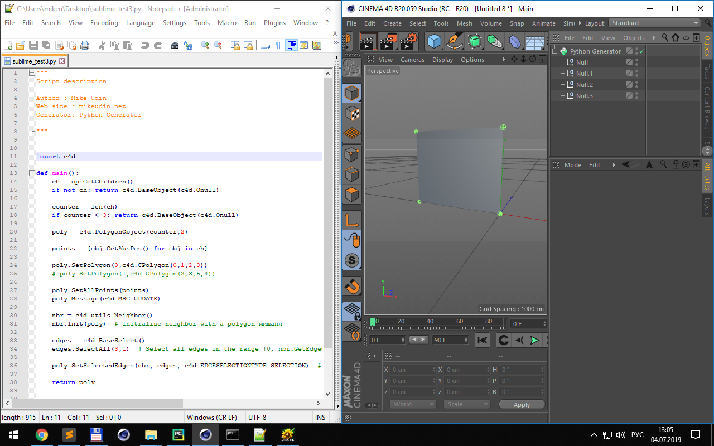
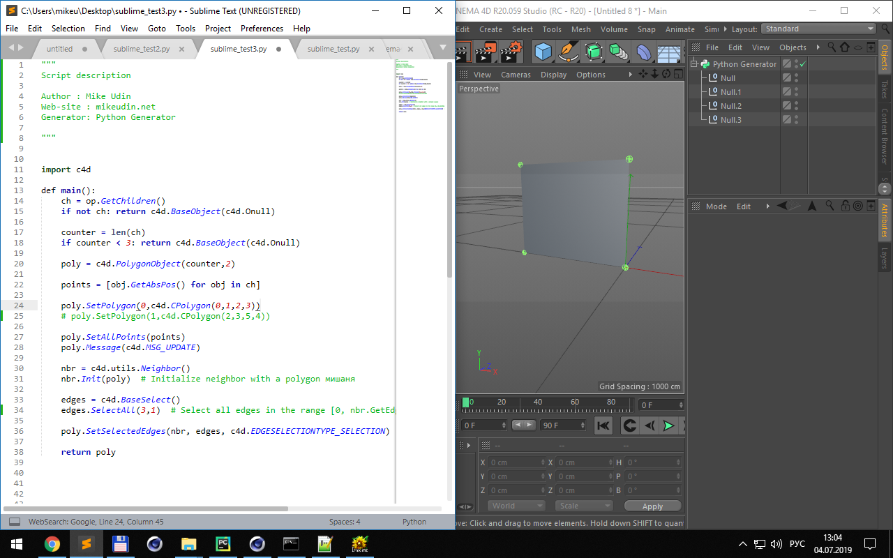
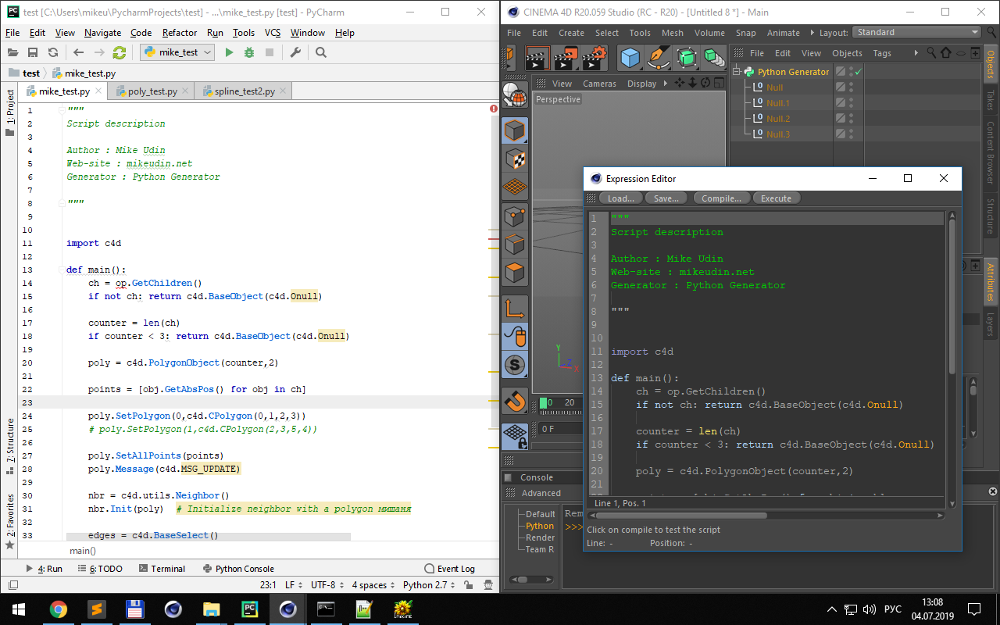

# SendPythonCodeToCinema4D

**SendPythonCodeToCinema4D** is a plugin for **Cinema 4D** that allows you to sent python script code to Cinema 4D and execute it. Plug-in based on Niklas Rosenstein's **Remote Code Runner**. [Get it here.](https://github.com/markkorput/sublime-script) 

## Installation

Download the latest code from GitHub and unpack the content into your Cinema 4D plugin directory.
    
    ```
    Cinema 4D RXX/
        plugins/
            SendPythonCodeToCinema4D/
                SendPythonCodeToCinema4D.pyp
                send_python_code.py
    
    ```
      
## How to use

Use command line to send python script code to Cinema 4D:
```
cmd python -u "d:\Your Cinema 4D Plugins\SendPythonCode\send_python_code.py" --file "c:\\script.py"
``` 
or use full path to python executable: 
```
cmd "c:\Python27\python.exe" -u "d:\Your Cinema 4D Plugins\SendPythonCode\send_python_code.py" --file "c:\\script.py"
```

## Text editor integration
You can use **SendPythonCodeToCinema4D** with different code editors like a Notepad++, Sublime Text or PyCharm.

### Notepad++


Open menu **Run** and write:
```
python -u "d:\Your Cinema 4D Plugins\SendPythonCode\send_python_code.py" --file "$(FULL_CURRENT_PATH)" --origin "Notepad++"
```
Setup run-command name and press **Save**. Now you can send code from opened for editing python script file to Cinema 4D.
Also using Notepad++ **NppExec** plug-in you can send to Cinema 4D *unsaved* code. Install **NppExec** plug-in, open menu **Plugins > NppExec > Execute** and enter this code:
```
set TEMP_PATH = $(NPP_DIRECTORY)\temp_script.py
text_saveto "$(TEMP_PATH)"
python -u "d:\Your Cinema 4D Plugins\SendPythonCode\send_python_code.py" --file "$(TEMP_PATH)" --origin "Notepad++"
``` 
### Sublime Text

Open **Tools > Build System > New Build system**. Paste this code:
```py
{
    "cmd": ["python", "-u", "d:\\Your Cinema 4D Plugins\\SendPythonCode\\send_python_code.py", "--file", "$file", "--origin","Sublime Text"],
    "selector": "source.python",
    "file_regex": "^\\s*File \"(...*?)\", line ([0-9]*)"
}
```
Save file with desired name. Then go to **Tools > Build System** and select already created  Build system. To send code to Cinema 4D use command **Tools > Build**. Also for more convienient use you can setup shortkey.

### PyCharm  

Go to menu **File > Settings > Tools > External Tools**. 
Setup Tool settings like this:
```
Name: SendCodeToC4D
Description: Send python code to Cinema 4D from PyCharm 
Program: python (or c:\Python27\python.exe)
Arguments: -u "d:\Your Cinema 4D Plugins\SendPythonCode\send_python_code.py" --file $FilePath$ --origin PyCharm
Working directory: $FileDir$
```
To send code to Cinema 4D use command **Tools > External tools > SendCodeToC4D**. Also for more convienient use you can setup shortkey.


## Advanced features
You can use **SendPythonCodeToCinema4D** also for editing Cinema 4D Python objects like a *Python Generator*, *Python Effector*, *Python Tag* and *Python Field*. For that use script code docstring:

To change code in **Python generator** use in docstring:
```c
Generator: <Your python generator object name>
``` 
To change code in **Python effector** use in docstring:
```c
Effector: <Your python effector object name>
``` 
To change code in **Python tag** use in docstring:
```c
Tag: <Your python tag name>
``` 
To change code in **Python field** use in docstring:
```c
Field: <Your python field object name>
``` 

### Example:
After sending this code to scene all Python field objects with name  "Python Field" will recive it.
```py
"""
Python Field description

Author : Mike Udin
Web-site : mikeudin.net
Field : Python Field

"""
import c4d

def main():
	# code here
    pass
```

[mikeudin.net](https://mikeudin.net/)

 
